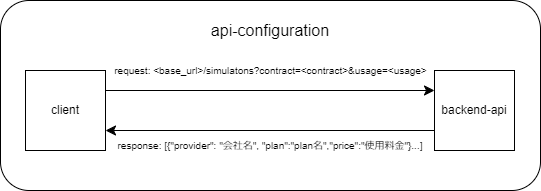

# electricity-rate-simulator

## tl;dr
frontからuser情報を受け取って、電気料金をシミュレートするbackend api


## 構成

- applicationの構成  
    
- apiの構成  
    
- backend-apiの構成  
    


## 使い方

### GET /simulations

#### request
```url
<base_url>/simulations?contract=<contract>&usage=<usage>
```

|parameters|type|dscription|
|--|--|--|
|contract|int|契約アンペア数|
|usage|int|使用量|


#### response
```json
[{"provider": "会社名", "plan": "plan名", "price": "xxxxxx円"},{...}...]
```

## 開発者向け

### 事前設定
vscodeの[.devcontaier](https://code.visualstudio.com/docs/devcontainers/containers)機能を用いて開発


### projectのインストール
```bash
$ poetry install
```

### server 起動
```bash
$ cd electricity-rate-simulator/electricity_rate_simulator
$ poetry run python electricity-rate-simulator/electricity_rate_simulator/app.py
```

### apiの仕様
server起動後、以下のurlにアクセス
```bash
<base_url>/docs
```
